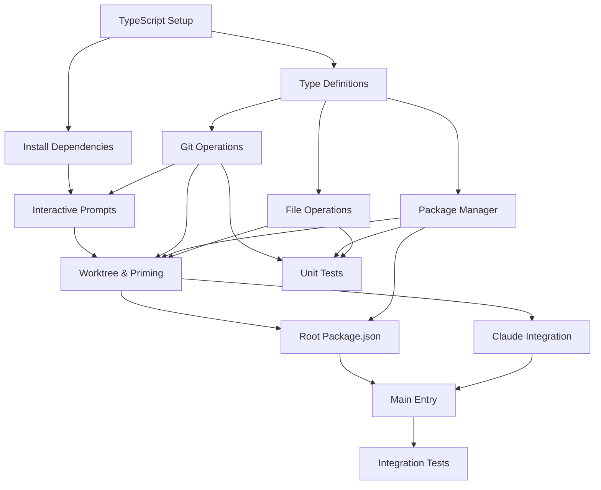

# Task Breakdown: ccws CLI Workspace Generator
Generated: August 26, 2025
Source: specs/feat-ccws-cli-workspace-generator-v2.md

## Overview
Building a macOS CLI tool that generates disposable Claude Code workspaces by orchestrating multiple git repositories using worktrees, with 5 core modules and full Claude CLI integration.

## Phase 1: Foundation Setup

### Task 1.1: Initialize TypeScript Project
**Description**: Set up TypeScript project with ESM configuration
**Size**: Small
**Priority**: High
**Dependencies**: None
**Can run parallel with**: None

**Technical Requirements**:
- TypeScript ^5.5.4 with ES2022 target
- ES modules configuration
- Source maps enabled
- Strict mode for type safety

**Implementation Steps**:
1. Initialize npm project with `npm init -y`
2. Install TypeScript: `npm install --save-dev typescript@^5.5.4`
3. Create tsconfig.json with ESM configuration
4. Set up build script in package.json

**Files to create**:

tsconfig.json:
```json
{
  "compilerOptions": {
    "target": "ES2022",
    "module": "ES2022",
    "moduleResolution": "Bundler",
    "outDir": "dist",
    "rootDir": "src",
    "resolveJsonModule": true,
    "declaration": false,
    "esModuleInterop": true,
    "forceConsistentCasingInFileNames": true,
    "skipLibCheck": true,
    "sourceMap": true,
    "strict": true
  },
  "include": ["src/**/*.ts"]
}
```

package.json updates:
```json
{
  "type": "module",
  "bin": { "ccws": "dist/index.js" },
  "scripts": {
    "build": "tsc -p .",
    "dev": "node --enable-source-maps dist/index.js",
    "prepublishOnly": "npm run build"
  }
}
```

**Acceptance Criteria**:
- [ ] TypeScript compiles without errors
- [ ] ES modules work correctly
- [ ] Source maps generate properly
- [ ] Build script creates dist/ folder

### Task 1.2: Install Core Dependencies
**Description**: Install all required npm packages
**Size**: Small
**Priority**: High
**Dependencies**: Task 1.1
**Can run parallel with**: Task 1.3

**Technical Requirements**:
- @inquirer/prompts ^7.0.0
- execa ^9.3.0
- fs-extra ^11.2.0
- picocolors ^1.0.0
- @agent-io/stream ^0.2.0 (optional)
- @types/node ^22.0.0 (dev)

**Implementation Steps**:
1. Install required dependencies:
```bash
npm install @inquirer/prompts@^7.0.0 execa@^9.3.0 fs-extra@^11.2.0 picocolors@^1.0.0
```

2. Install optional dependency:
```bash
npm install --save-optional @agent-io/stream@^0.2.0
```

3. Install dev dependencies:
```bash
npm install --save-dev @types/node@^22.0.0
```

**Acceptance Criteria**:
- [ ] All dependencies installed successfully
- [ ] No version conflicts
- [ ] package-lock.json created
- [ ] Optional dependency handled correctly

### Task 1.3: Create Type Definitions
**Description**: Define core TypeScript types for the application
**Size**: Small
**Priority**: High
**Dependencies**: Task 1.1
**Can run parallel with**: Task 1.2

**Technical Requirements**:
- RepoPick type for user selections
- RepoMounted type with workspace info
- Package manager union type

**Implementation - src/types.ts**:
```typescript
export type RepoPick = {
  alias: string;         // User-friendly name
  basePath: string;      // Path to original repo
  branch: string;        // Branch to checkout
};

export type RepoMounted = RepoPick & {
  worktreePath: string;  // Path in workspace/repos/<alias>
  packageManager: 'npm' | 'yarn' | 'pnpm';
};
```

**Acceptance Criteria**:
- [ ] Types compile without errors
- [ ] Types are exported correctly
- [ ] Types cover all needed properties

## Phase 2: Core Module Implementation

### Task 2.1: Implement Git Operations Module
**Description**: Create git.ts with worktree operations and repo discovery
**Size**: Medium
**Priority**: High
**Dependencies**: Task 1.1, 1.3
**Can run parallel with**: Task 2.2, 2.3

**Technical Requirements**:
- Repository discovery using find command
- Current branch detection
- Worktree creation
- Error handling for git operations

**Implementation - src/git.ts**:
```typescript
import { execa } from 'execa';
import path from 'path';

export async function discoverRepos(baseDir: string): Promise<string[]> {
  try {
    const { stdout } = await execa('find', [
      baseDir, 
      '-maxdepth', '3',
      '-type', 'd',
      '-name', '.git',
      '-prune'
    ]);
    return stdout.split('\n')
      .filter(Boolean)
      .map(p => p.replace('/.git', ''));
  } catch (error) {
    console.error('Failed to discover repos:', error);
    return [];
  }
}

export async function currentBranch(repoPath: string): Promise<string> {
  try {
    const { stdout } = await execa('git', [
      '-C', repoPath, 
      'rev-parse', 
      '--abbrev-ref', 
      'HEAD'
    ]);
    return stdout.trim();
  } catch {
    return 'main'; // Default fallback
  }
}

export async function addWorktree(
  baseRepo: string, 
  branch: string, 
  worktreeDir: string
): Promise<void> {
  // Fetch latest changes
  try {
    await execa('git', ['-C', baseRepo, 'fetch', 'origin'], { 
      stdio: 'ignore' 
    });
  } catch {
    // Continue even if fetch fails (offline mode)
  }
  
  // Create worktree
  await execa('git', [
    '-C', baseRepo, 
    'worktree', 'add', 
    worktreeDir, branch
  ]);
}
```

**Acceptance Criteria**:
- [ ] Find command discovers .git directories correctly
- [ ] Current branch detection works
- [ ] Worktree creation succeeds
- [ ] Error handling prevents crashes
- [ ] Works offline (fetch failure handled)

### Task 2.2: Implement Package Manager Detection
**Description**: Create pm.ts for detecting and handling npm/yarn/pnpm
**Size**: Small
**Priority**: High
**Dependencies**: Task 1.1, 1.3
**Can run parallel with**: Task 2.1, 2.3

**Technical Requirements**:
- Detect package manager from lockfiles
- Generate correct run commands per PM
- Handle all three: npm, yarn, pnpm

**Implementation - src/pm.ts**:
```typescript
import { existsSync } from 'fs';
import { join } from 'path';

export function detectPM(dir: string): 'npm' | 'yarn' | 'pnpm' {
  // Check for lockfiles
  if (existsSync(join(dir, 'yarn.lock'))) return 'yarn';
  if (existsSync(join(dir, 'pnpm-lock.yaml'))) return 'pnpm';
  
  // Check package.json packageManager field
  try {
    const pkgPath = join(dir, 'package.json');
    if (existsSync(pkgPath)) {
      const pkg = require(pkgPath);
      const pmField = pkg?.packageManager;
      if (pmField?.startsWith('yarn')) return 'yarn';
      if (pmField?.startsWith('pnpm')) return 'pnpm';
    }
  } catch {
    // Ignore errors
  }
  
  return 'npm'; // Default
}

export function pmRun(
  pm: 'npm' | 'yarn' | 'pnpm', 
  alias: string, 
  script: string
): string {
  switch(pm) {
    case 'yarn': 
      return `yarn --cwd ./repos/${alias} ${script}`;
    case 'pnpm': 
      return `pnpm -C ./repos/${alias} ${script}`;
    default: 
      return `npm --prefix ./repos/${alias} run ${script}`;
  }
}
```

**Acceptance Criteria**:
- [ ] Correctly identifies yarn from yarn.lock
- [ ] Correctly identifies pnpm from pnpm-lock.yaml
- [ ] Falls back to npm when no indicators
- [ ] pmRun generates correct commands for each PM
- [ ] Commands use correct directory flags

### Task 2.3: Implement File Operations Module
**Description**: Create fsops.ts for workspace priming operations
**Size**: Medium
**Priority**: High
**Dependencies**: Task 1.1, 1.3
**Can run parallel with**: Task 2.1, 2.2

**Technical Requirements**:
- Hardlink node_modules for performance
- Fallback to rsync if hardlink fails
- Copy environment files
- Handle missing source directories

**Implementation - src/fsops.ts**:
```typescript
import { execa } from 'execa';
import { existsSync } from 'fs';
import { join, basename } from 'path';
import { ensureDir, writeFile, copyFile } from 'fs-extra';

export async function ensureWorkspaceSkeleton(wsDir: string): Promise<void> {
  await ensureDir(join(wsDir, 'repos'));
  await writeFile(
    join(wsDir, '.gitignore'), 
    'repos/\nnode_modules/\n.env*\n'
  );
}

export async function primeNodeModules(
  src: string, 
  dst: string
): Promise<void> {
  const srcPath = join(src, 'node_modules');
  const dstPath = join(dst, 'node_modules');
  
  // Skip if source doesn't exist
  if (!existsSync(srcPath)) return;
  
  // Try hardlink first (fast on same filesystem)
  try {
    await execa('cp', ['-al', srcPath, dstPath]);
    return;
  } catch {
    // Hardlink failed, try rsync
  }
  
  // Fallback to rsync
  try {
    await execa('rsync', [
      '-a', 
      '--delete',
      `${srcPath}/`, 
      `${dstPath}/`
    ]);
  } catch (error) {
    console.warn(`Failed to prime node_modules for ${dst}:`, error);
  }
}

export async function copyEnvFiles(
  src: string, 
  dst: string
): Promise<void> {
  try {
    // Find all .env* files in source
    const { stdout } = await execa('find', [
      src, 
      '-maxdepth', '1', 
      '-name', '.env*', 
      '-type', 'f'
    ]);
    
    const files = stdout.split('\n').filter(Boolean);
    
    // Copy each file
    for (const file of files) {
      const destFile = join(dst, basename(file));
      await copyFile(file, destFile);
    }
  } catch (error) {
    console.warn(`Failed to copy env files:`, error);
  }
}
```

**Acceptance Criteria**:
- [ ] Workspace skeleton created correctly
- [ ] Hardlink works on same filesystem
- [ ] Rsync fallback works cross-filesystem
- [ ] Environment files copied successfully
- [ ] Missing node_modules handled gracefully
- [ ] Errors logged but don't crash

## Phase 3: Main Application Implementation

### Task 3.1: Implement Interactive Prompts
**Description**: Create user interaction flow with @inquirer/prompts
**Size**: Large
**Priority**: High
**Dependencies**: Task 1.2, 2.1
**Can run parallel with**: None (blocks other Phase 3 tasks)

**Technical Requirements**:
- Base directory input
- Repository multi-select
- Alias and branch configuration
- Error handling for user cancellation

**Implementation excerpt for main flow**:
```typescript
import { input, checkbox } from '@inquirer/prompts';
import { basename } from 'path';
import { discoverRepos, currentBranch } from './git.js';
import type { RepoPick } from './types.js';

async function getUserSelections(): Promise<RepoPick[]> {
  // 1. Get base directory
  const baseDir = await input({ 
    message: 'Base directory for repos',
    default: process.cwd() 
  });

  // 2. Discover repos
  const repos = await discoverRepos(baseDir);
  
  if (repos.length === 0) {
    throw new Error(`No git repositories found in ${baseDir}`);
  }
  
  // 3. Select repos
  const selected = await checkbox({
    message: 'Select repositories',
    choices: repos.map(r => ({ 
      name: basename(r), 
      value: r 
    })),
    required: true
  });

  if (selected.length === 0) {
    throw new Error('No repositories selected');
  }

  // 4. Configure each repo
  const repoPicks: RepoPick[] = [];
  for (const repo of selected) {
    const alias = await input({ 
      message: `Alias for ${basename(repo)}`,
      default: basename(repo)
    });
    
    const defaultBranch = await currentBranch(repo);
    const branch = await input({
      message: `Branch for ${alias}`,
      default: defaultBranch
    });
    
    repoPicks.push({ alias, basePath: repo, branch });
  }
  
  return repoPicks;
}
```

**Acceptance Criteria**:
- [ ] Base directory prompt works with default
- [ ] Repository discovery shows found repos
- [ ] Multi-select allows choosing multiple repos
- [ ] Alias customization works
- [ ] Branch selection shows current branch as default
- [ ] User cancellation handled gracefully

### Task 3.2: Implement Worktree Creation and Priming
**Description**: Mount worktrees and prime with dependencies/env files
**Size**: Medium
**Priority**: High
**Dependencies**: Task 3.1, 2.1, 2.2, 2.3
**Can run parallel with**: None

**Technical Requirements**:
- Create workspace directory structure
- Mount worktrees for each selected repo
- Prime with node_modules via hardlinks
- Copy environment files
- Track mounted repos with metadata

**Implementation for workspace creation**:
```typescript
import { resolve, join } from 'path';
import { ensureWorkspaceSkeleton, primeNodeModules, copyEnvFiles } from './fsops.js';
import { addWorktree } from './git.js';
import { detectPM } from './pm.js';
import type { RepoPick, RepoMounted } from './types.js';

async function createWorkspace(repoPicks: RepoPick[]): Promise<{
  wsDir: string;
  mounted: RepoMounted[];
}> {
  // Generate workspace name
  const wsName = `ccws-${Date.now().toString(36)}`;
  const wsDir = resolve(wsName);
  
  // Create workspace structure
  await ensureWorkspaceSkeleton(wsDir);
  
  // Mount each repository
  const mounted: RepoMounted[] = [];
  
  for (const pick of repoPicks) {
    const worktreePath = join(wsDir, 'repos', pick.alias);
    
    console.log(`Creating worktree for ${pick.alias}...`);
    
    // Create worktree
    await addWorktree(pick.basePath, pick.branch, worktreePath);
    
    // Prime with dependencies
    console.log(`Priming ${pick.alias} with dependencies...`);
    await primeNodeModules(pick.basePath, worktreePath);
    
    // Copy environment files
    await copyEnvFiles(pick.basePath, worktreePath);
    
    // Detect package manager
    const packageManager = detectPM(worktreePath);
    
    mounted.push({
      ...pick,
      worktreePath,
      packageManager
    });
  }
  
  return { wsDir, mounted };
}
```

**Acceptance Criteria**:
- [ ] Workspace directory created with timestamp
- [ ] .gitignore created in workspace root
- [ ] Worktrees created for all selected repos
- [ ] node_modules primed via hardlinks/rsync
- [ ] Environment files copied successfully
- [ ] Package manager detected for each repo

### Task 3.3: Generate Root Package.json
**Description**: Create unified command interface in workspace root
**Size**: Medium
**Priority**: High
**Dependencies**: Task 3.2, 2.2
**Can run parallel with**: Task 3.4

**Technical Requirements**:
- Generate scripts for each repo/command combo
- Add concurrently for parallel dev execution
- Use correct PM commands per repo
- Private package to prevent accidental publishing

**Implementation for package.json generation**:
```typescript
import { writeJson } from 'fs-extra';
import { join } from 'path';
import { pmRun } from './pm.js';
import type { RepoMounted } from './types.js';

async function generateRootPackageJson(
  wsDir: string, 
  mounted: RepoMounted[]
): Promise<void> {
  const scripts: Record<string, string> = {};
  
  // Generate per-repo scripts
  for (const repo of mounted) {
    for (const cmd of ['dev', 'build', 'test', 'lint']) {
      scripts[`${repo.alias}:${cmd}`] = pmRun(
        repo.packageManager, 
        repo.alias, 
        cmd
      );
    }
  }
  
  // Generate combined dev script
  if (mounted.length > 0) {
    const devCommands = mounted
      .map(r => `"npm run ${r.alias}:dev"`)
      .join(' ');
    
    scripts.dev = `concurrently -n ${mounted.map(r => r.alias.toUpperCase()).join(',')} ${devCommands}`;
  }
  
  // Create package.json
  const packageJson = {
    name: 'cc-workspace',
    version: '1.0.0',
    private: true,
    description: 'Claude Code workspace',
    scripts,
    devDependencies: {
      concurrently: '^9.0.0'
    }
  };
  
  await writeJson(join(wsDir, 'package.json'), packageJson, { 
    spaces: 2 
  });
}
```

**Acceptance Criteria**:
- [ ] Scripts generated for all repos and commands
- [ ] Concurrently added as devDependency
- [ ] Combined dev script runs all repos
- [ ] Package marked as private
- [ ] JSON formatted with 2 spaces

### Task 3.4: Implement Claude CLI Integration
**Description**: Generate CLAUDE.md via Claude CLI with streaming
**Size**: Large
**Priority**: High
**Dependencies**: Task 3.2
**Can run parallel with**: Task 3.3

**Technical Requirements**:
- Create factpack files for each repo
- Generate prompt for Claude CLI
- Handle @agent-io/stream if available
- Fallback to plain output if not
- Write final CLAUDE.md to workspace

**Implementation for Claude integration**:
```typescript
import { join } from 'path';
import { readJson, writeFile } from 'fs-extra';
import { execa } from 'execa';
import type { RepoMounted } from './types.js';

async function generateClaudeMd(
  wsDir: string, 
  repos: RepoMounted[]
): Promise<void> {
  // Create factpacks for each repo
  for (const repo of repos) {
    try {
      const pkg = await readJson(
        join(repo.worktreePath, 'package.json')
      );
      
      const facts = [
        `Alias: ${repo.alias}`,
        `Package: ${pkg.name || 'unknown'}`,
        `Branch: ${repo.branch}`,
        `PM: ${repo.packageManager}`,
        'Scripts:',
        ...Object.keys(pkg.scripts || {}).map(s => `  - ${s}`)
      ];
      
      await writeFile(
        join(repo.worktreePath, '.factpack.txt'),
        facts.join('\n')
      );
    } catch (error) {
      console.warn(`Failed to create factpack for ${repo.alias}:`, error);
    }
  }

  // Generate prompt
  const prompt = `Generate a CLAUDE.md workspace guide.
  
Repos:
${repos.map(r => `- ${r.alias}: ${r.branch}`).join('\n')}

Include:
- Available commands (npm run <alias>:*)
- How to start dev mode
- Repo responsibilities
  
Keep it under 100 lines.`;

  console.log('Generating CLAUDE.md via Claude CLI...');

  // Invoke Claude CLI with streaming
  const child = execa('claude', ['code', '--non-interactive'], {
    env: {
      ...process.env,
      ...(process.env.CLAUDE_CLI_ARGS ? {
        CLAUDE_CLI_ARGS: process.env.CLAUDE_CLI_ARGS
      } : {})
    }
  });
  
  // Try to use @agent-io/stream if available
  let streamHandler: any = null;
  try {
    const agentIo = await import('@agent-io/stream');
    const renderer = agentIo.createStreamRenderer({
      onText: (t: string) => process.stdout.write(t)
    });
    streamHandler = renderer;
    child.stdout?.on('data', (buf: Buffer) => {
      renderer.push(buf.toString());
    });
  } catch {
    // Fallback: pipe directly to stdout
    child.stdout?.pipe(process.stdout);
  }
  
  // Send prompt
  child.stdin?.write(prompt);
  child.stdin?.end();
  
  // Wait for completion and save
  try {
    const { stdout } = await child;
    await writeFile(join(wsDir, 'CLAUDE.md'), stdout);
  } catch (error) {
    // Fallback: write a basic template
    const fallback = `# Claude Code Workspace

## Repositories
${repos.map(r => `- **${r.alias}**: ${r.branch}`).join('\n')}

## Commands
Run from workspace root:
- \`npm run dev\` - Start all repos in dev mode
${repos.map(r => `- \`npm run ${r.alias}:dev\` - Start ${r.alias} only`).join('\n')}

## Getting Started
1. \`npm install\`
2. \`npm run dev\`
`;
    await writeFile(join(wsDir, 'CLAUDE.md'), fallback);
    console.warn('Claude CLI failed, using fallback template');
  }
}
```

**Acceptance Criteria**:
- [ ] Factpack files created for each repo
- [ ] Claude CLI invoked with correct prompt
- [ ] Streaming works if @agent-io/stream available
- [ ] Falls back to plain output if not
- [ ] Fallback template used if CLI fails
- [ ] CLAUDE.md created in workspace root

### Task 3.5: Implement Main Entry Point
**Description**: Wire everything together in index.ts
**Size**: Medium
**Priority**: High
**Dependencies**: All previous tasks
**Can run parallel with**: None

**Technical Requirements**:
- Shebang for CLI execution
- Import all modules
- Error handling
- Success output with next steps

**Implementation - src/index.ts**:
```typescript
#!/usr/bin/env node
import picocolors from 'picocolors';
const { green, red, yellow } = picocolors;

// Import all our modules
import { getUserSelections } from './prompts.js';
import { createWorkspace } from './workspace.js';
import { generateRootPackageJson } from './package.js';
import { generateClaudeMd } from './claude.js';

async function main() {
  try {
    console.log(green('🚀 Claude Code Workspace Generator\n'));
    
    // Get user selections
    const repoPicks = await getUserSelections();
    
    // Create workspace and mount repos
    const { wsDir, mounted } = await createWorkspace(repoPicks);
    
    // Generate root package.json
    await generateRootPackageJson(wsDir, mounted);
    
    // Generate CLAUDE.md
    await generateClaudeMd(wsDir, mounted);
    
    // Success output
    console.log('\n' + green(`✓ Workspace ready: ${wsDir}`));
    console.log(yellow('\nNext steps:'));
    console.log(`  cd ${wsDir}`);
    console.log('  npm install');
    console.log('  npm run dev');
    
  } catch (error) {
    console.error(red('\n❌ Error:'), error);
    process.exit(1);
  }
}

// Run if executed directly
if (import.meta.url === `file://${process.argv[1]}`) {
  main().catch(console.error);
}

export { main };
```

**Acceptance Criteria**:
- [ ] Shebang allows direct execution
- [ ] All modules imported correctly
- [ ] Error handling shows clear messages
- [ ] Success output shows next steps
- [ ] Process exits with correct codes

## Phase 4: Testing and Documentation

### Task 4.1: Write Unit Tests
**Description**: Create unit tests for core modules
**Size**: Medium
**Priority**: Medium
**Dependencies**: All Phase 2 tasks
**Can run parallel with**: Task 4.2, 4.3

**Technical Requirements**:
- Test package manager detection
- Test command generation
- Test path operations
- Use Jest or Vitest

**Test implementations**:

```typescript
// tests/pm.test.ts
import { describe, test, expect } from 'vitest';
import { detectPM, pmRun } from '../src/pm.js';
import { mkdtempSync, writeFileSync } from 'fs';
import { join } from 'path';
import { tmpdir } from 'os';

describe('Package Manager Detection', () => {
  test('detects yarn from yarn.lock', () => {
    const dir = mkdtempSync(join(tmpdir(), 'test-'));
    writeFileSync(join(dir, 'yarn.lock'), '');
    expect(detectPM(dir)).toBe('yarn');
  });
  
  test('detects pnpm from pnpm-lock.yaml', () => {
    const dir = mkdtempSync(join(tmpdir(), 'test-'));
    writeFileSync(join(dir, 'pnpm-lock.yaml'), '');
    expect(detectPM(dir)).toBe('pnpm');
  });
  
  test('defaults to npm without lockfiles', () => {
    const dir = mkdtempSync(join(tmpdir(), 'test-'));
    expect(detectPM(dir)).toBe('npm');
  });
});

describe('Command Generation', () => {
  test('generates yarn commands correctly', () => {
    expect(pmRun('yarn', 'frontend', 'dev'))
      .toBe('yarn --cwd ./repos/frontend dev');
  });
  
  test('generates pnpm commands correctly', () => {
    expect(pmRun('pnpm', 'backend', 'build'))
      .toBe('pnpm -C ./repos/backend build');
  });
  
  test('generates npm commands correctly', () => {
    expect(pmRun('npm', 'shared', 'test'))
      .toBe('npm --prefix ./repos/shared run test');
  });
});
```

**Acceptance Criteria**:
- [ ] All detection tests pass
- [ ] All command generation tests pass
- [ ] Tests are isolated (use temp dirs)
- [ ] Tests clean up after themselves

### Task 4.2: Write Integration Tests
**Description**: Test complete workspace generation flow
**Size**: Medium
**Priority**: Medium
**Dependencies**: All Phase 3 tasks
**Can run parallel with**: Task 4.1, 4.3

**Technical Requirements**:
- Test worktree creation
- Test full workspace generation
- Mock Claude CLI for consistency

**Integration test**:
```typescript
// tests/integration.test.ts
import { describe, test, expect, beforeAll, afterAll } from 'vitest';
import { mkdtempSync, existsSync } from 'fs';
import { join } from 'path';
import { tmpdir } from 'os';
import { execa } from 'execa';

describe('Workspace Generation', () => {
  let testRepo: string;
  
  beforeAll(async () => {
    // Create a test git repo
    testRepo = mkdtempSync(join(tmpdir(), 'test-repo-'));
    await execa('git', ['init'], { cwd: testRepo });
    await execa('git', ['config', 'user.email', 'test@test.com'], { cwd: testRepo });
    await execa('git', ['config', 'user.name', 'Test'], { cwd: testRepo });
    await writeFileSync(join(testRepo, 'package.json'), JSON.stringify({
      name: 'test-repo',
      scripts: { dev: 'echo dev' }
    }));
    await execa('git', ['add', '.'], { cwd: testRepo });
    await execa('git', ['commit', '-m', 'initial'], { cwd: testRepo });
  });
  
  test('creates worktree successfully', async () => {
    const worktreeDir = mkdtempSync(join(tmpdir(), 'worktree-'));
    await addWorktree(testRepo, 'main', worktreeDir);
    expect(existsSync(join(worktreeDir, '.git'))).toBe(true);
    expect(existsSync(join(worktreeDir, 'package.json'))).toBe(true);
  });
  
  afterAll(async () => {
    // Cleanup
    await execa('rm', ['-rf', testRepo]);
  });
});
```

**Acceptance Criteria**:
- [ ] Test repo created successfully
- [ ] Worktree creation works
- [ ] Files exist in worktree
- [ ] Cleanup removes test files

### Task 4.3: Create README Documentation
**Description**: Write comprehensive user documentation
**Size**: Small
**Priority**: High
**Dependencies**: None
**Can run parallel with**: Task 4.1, 4.2

**Technical Requirements**:
- Installation instructions
- Usage examples
- Requirements list
- Troubleshooting section

**README.md content**:
```markdown
# ccws

Quick multi-repo workspace generator for Claude Code.

## Features

- 🚀 Create workspaces in <60 seconds
- 🌳 Git worktrees for minimal disk usage  
- 📦 Automatic dependency priming
- 🤖 Claude Code integration
- 🎯 Zero manual setup after generation

## Requirements

- macOS (uses cp -al, rsync)
- Git 2.20+ (worktree support)
- Node.js 18+ (ES modules)
- Claude CLI installed

## Install

```bash
npm install -g ccws
```

## Usage

```bash
ccws
```

Follow the interactive prompts to:
1. Choose base directory for repo discovery
2. Select repositories to include
3. Set aliases and branches
4. Get workspace path

Then:
```bash
cd ccws-abc123
npm install
npm run dev
```

## Commands

From workspace root:
- `npm run dev` - Start all repos in dev mode
- `npm run <alias>:dev` - Start specific repo
- `npm run <alias>:build` - Build specific repo
- `npm run <alias>:test` - Test specific repo

## Configuration

Set `CLAUDE_CLI_ARGS` environment variable to customize Claude CLI flags:
```bash
export CLAUDE_CLI_ARGS="--model claude-3-opus"
```

## Troubleshooting

**Worktree already exists**: Remove with `git worktree remove <path>`

**Hardlink fails**: Ensures source and destination are on same filesystem

**Claude CLI fails**: Check Claude CLI is installed and authenticated

## License

MIT
```

**Acceptance Criteria**:
- [ ] Installation instructions clear
- [ ] Usage examples complete
- [ ] Requirements documented
- [ ] Troubleshooting covers common issues
- [ ] Commands well explained

## Dependency Graph



## Summary

- **Total Tasks**: 13
- **Phase 1 (Foundation)**: 3 tasks
- **Phase 2 (Core Modules)**: 3 tasks
- **Phase 3 (Main Implementation)**: 5 tasks
- **Phase 4 (Testing & Docs)**: 3 tasks

**Parallel Execution Opportunities**:
- Phase 1: Tasks 1.2 and 1.3 can run in parallel
- Phase 2: All three tasks can run in parallel
- Phase 3: Tasks 3.3 and 3.4 can run in parallel
- Phase 4: All three tasks can run in parallel

**Critical Path**: 1.1 → 1.3 → 2.1 → 3.1 → 3.2 → 3.5